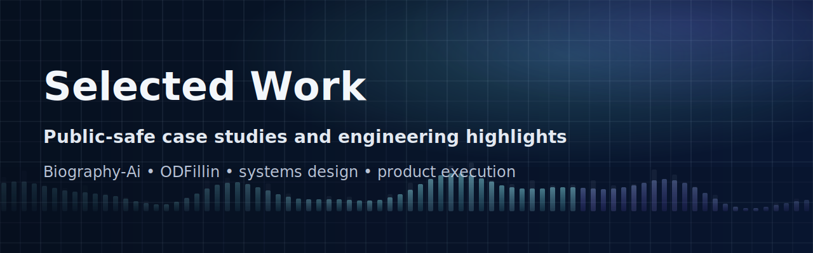

  

# Selected Work

A curated set of public-safe project summaries for work that mostly lives in private repositories.

## Why this repo exists

A lot of the systems I build are private. This repo gives a clear public view of the products, engineering scope, and execution patterns behind that work without exposing confidential details.

## Featured projects

- [Biography-Ai](./projects/biography-ai.md) - interactive memories and AI-guided storytelling
- [ODFillin](./projects/odfillin.md) - fill-in opportunities for optometrists

## What you will find here

- concise case studies
- public-safe system summaries
- product and delivery context
- notes on constraints, ownership, and outcomes

## What you will not find here

- secrets or internal implementation details
- non-public customer or operational data
- sensitive architecture diagrams
- private repository code

Use [CASE_STUDY_TEMPLATE.md](./CASE_STUDY_TEMPLATE.md) for future writeups.
